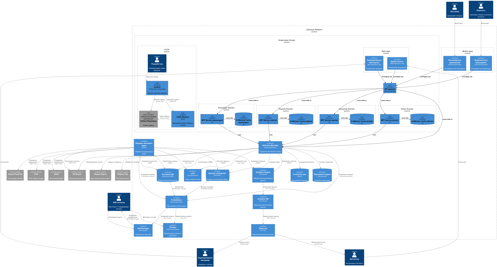

# ADR-000: Prepare architecture to migrationg on microservices architecture

**Status:** [Proposed | Accepted | Deprecated | Superseded by ADR-XXX]  
**Date:** YYYY-MM-DD  
**Author:** Marina Karmanova
**Stakeholders:** [List of affected teams/people]

---

## Executive Summary

We will create architecture to ease migration on microservices. It includes setup of api-gateway and BFF services for front apps

---

## Context & Problem Statement

### Current State
Mobile and web apps direct calls to monolith.

---

## Decision

- We will use Kubernetes instead of Docker. Web apps will be hosted as pods on k8s.
- We will set up api-gateway and BFF services for out mobile and web apps.
- Api-gateway allow to set up rules for redirect traffic between monolith app and future microservices
- BFF services will allow to split domains

---

## Considered Alternatives

### Alternative 1: Stay on Docker

**Description:**  
Reuse already used docker containerization

**Pros:**
- No need to do anything

**Cons:**
- Runs on one machine
- Manual scaling and restarting for containers

**Why rejected:**  
No proper scalability for enterprise level apps 

---

## Consequences

### Positive Outcomes ✅
- Automatic scaling
- Automatically replaces, restarts, and replicates failed containers
- Advanced, automated service routing and load balancing

### Negative Outcomes / Trade-offs ❌
- Need DevOps expertise

## Implementation Plan

### Immediate Actions (Next 2 Weeks)
- [ ] Setup K8s cluster
- [ ] Move Web apps to pods
- [ ] Setup Api Gateway to redirect traffic on monolith 
- [ ] Prepare CI/CD to work with k8s

### Short-term (1-3 Months)
- [ ] Develop BFF services for mobile and webs (simple requests redirect)
- [ ] Setup redirect traffic App (Web/Mobile) -> Api Gateway -> BFF Service -> Monolith
- [ ] Setup in-memory caches (Redis) for BFF Services to reduce traffic on Monolith

---

## References

---

## Review History

| Date | Reviewer | Comments | Status |
|------|----------|----------|--------|
| YYYY-MM-DD | [Name] | Initial proposal | Proposed |
| YYYY-MM-DD | [Name] | Approved with notes | Accepted |

---

## Appendix

*Optional: Add diagrams, code snippets, benchmarks, or detailed analysis.*

### Diagram